# Introduction, exploting the device for fun and profit

(disclamer: I knew next to nothing about arm v7 assembler and/or ghydra, this is more a how not to do things than anything else. But I think it can be a good starting point for someone starting a similar journey. )

I've found a couple of mistAP 41 in an e-waste facility, this model is reaching EOL, and in a few months I bet there will be more avaible in second hand markets and trash containers are all over the worrld. This device is based on ... , and I hope that is similar enough to the cisco meraki platfrom, recently supported in openwrt:
https://openwrt.org/toh/meraki/mx65w 

This device has 3 PCI BCM43465 wireless cards - wich I don't know the state of the current drivers but in general there's no good open source support for them - in an interesting configuration. One of the cards is on a standard mini-PCI socket (put a supported card and you have a very capable AP, profit!), the other two are connected to one mini PCI socket on a custom PCB. There's a PCI swith on the device, the custom PCB just has 2 standard BCM43465 cards on metalic shields for the glory of the FCC and other agencies. I haven't tried connecting one standard card there yet, but it will be easy enough to design a PCB with 2 standard mini PCI sockets, there's no extra circuitery on that board.

All of this, combined with the info from https://github.com/neggles/mist-ap41 makes for a very interesting 

So in a way, this is an exercise in futility. Once stablished that the answer to the TODO challenge it's just 'B' (it's ok to laugh, I couldn't believe it myself), we already own the device anyway, as mist ships with a very capable uboot (we can dump and write the eeprom, tftp boot and many other goodies). So why all of this you may ask?, the short answer is that I need different hobbies, get out and socialize more.

So if you are already please join me in a tale of binary madness, tears and countless sleeping nights. This is by no means a how to guide on ARM and Ghydra, is more of a technical tale with a few lessons learned.

# Picking the right target

In the device's ubidump files, the inittab file tell us that serial console it's gardded by the binary console_login. To start with, we can check if there are some readable strings on the binary, "strings" is your friendly command for this (the output is incomplete, I left only the interesing bits):
```
+//sys/devices/i2c1.1/i2c-0/0-0052/eeprom
Can't open %s: %s
/dev/urandom
%s: can't open /dev/urandom: %s
/etc/mist/version
FIRMWARE_VERSION=
FIRMWARE_MODEL=
/sys/class/net/aximac1/address
true
%s: no memory
developer
%s: bytes2base64 failed
challenge: %s
response: 
%s: error reading response: %s
Cm7nkp2X4cMfKuw0
fqxWAIytIQt26vkU
If you want this to be permanent set
 developer=%s
in uboot env
successful developer-mode console login
success
test
Usage: %s [-t] <username>
%s: can't parse option %c
manufacturing
mfg_magic
successful console login
regulatory
can't create socket: %s
/tmp/ep-control-proxy
can't open ep-ctrl: %s
console login attempt
%s: no EPID
failed developer-mode console login
failure
Incorrect response
sr7Krl7tkajVBowS
ZuSX01QGh8PJq0Na
/bin/login
exec failed: %s
failed console login
aeabi
Cortex-A9
```   

The first string is an error message "%s: bytes2base64 failed". This gives us the name of one function (bytes2base64), and we can guess that base64 encoding is being use at some point. Right after the string challenge: %s tell us that this is the binary we are looking for. There's more information, (like 4 interesting 16 bit strings and the path of 3 files), but at this point is not clear what they are used for.

# Time to start Ghidra

With no idea how the challenge is generated or checked, we need to decompile this little program. Let's start by creating a nee project in ghydra and importing the binary.

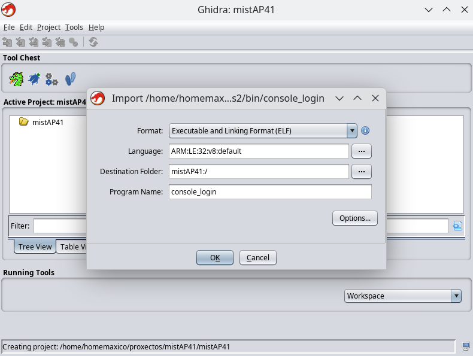

Here my dear reverse enginering aficionados we are faced with our first conundrum, Ghydra detects the binary as "ARM v8 32 little default", but the device SOC is a Cortex-A9 ARM v7 32 little endian. There could be a number of reasons for this, it could have been compiled for an arm v8 platform, (if it's not using any arm v8 only opcodes I guess it will work), or could be also Ghidra not correctly identifying the binary. I did a few tests and I didn't see any differences in the resulting pseudo code at first glance, but I decided to override Ghydra and specify an ARM v7 target. 

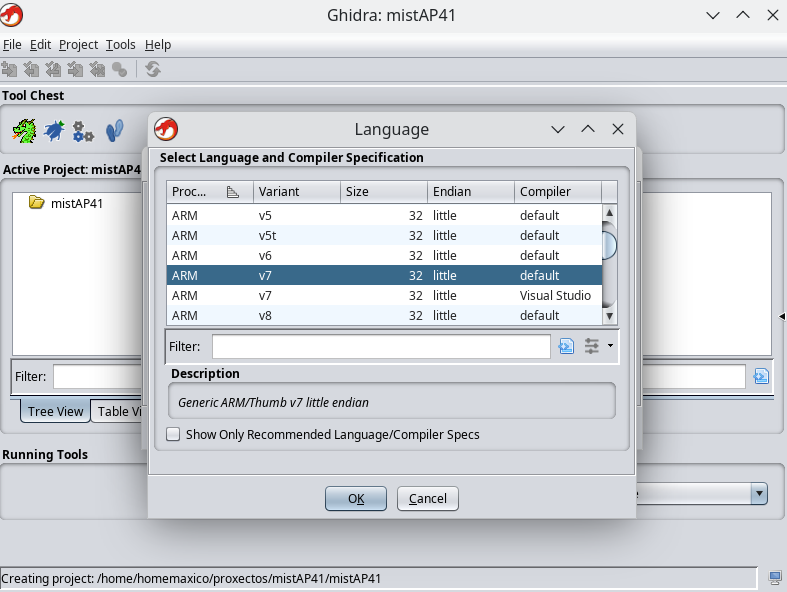

After hitting OK, we are presented with the Import result Summary:

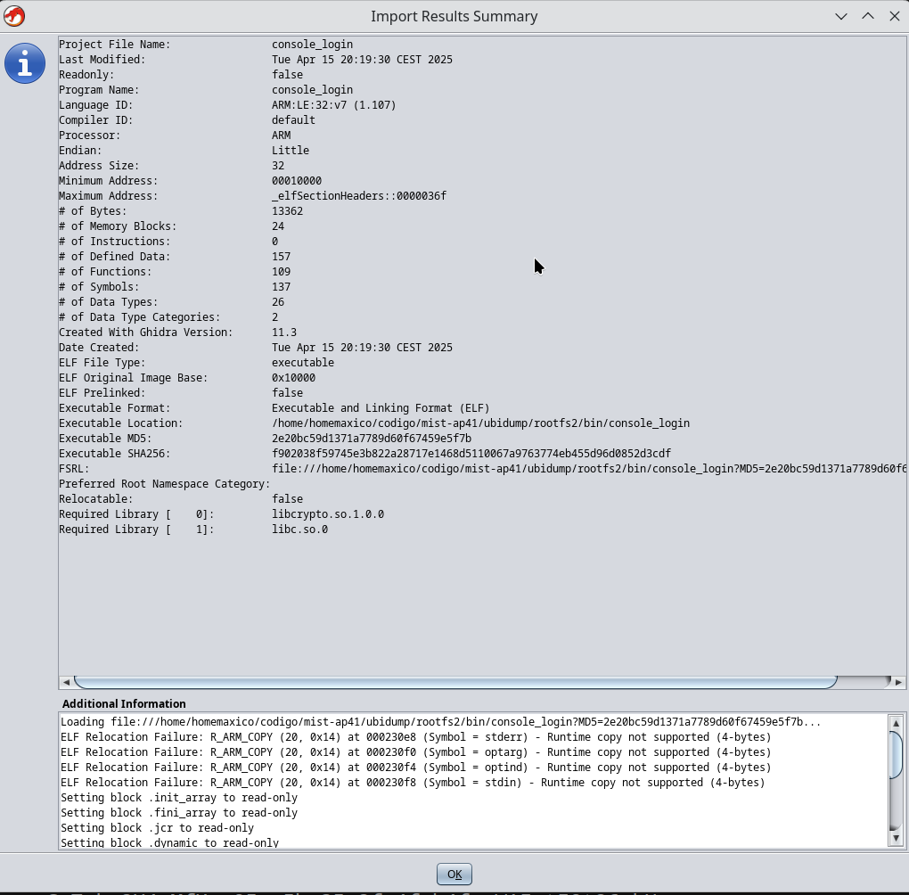

There are some ELF Relocation errors related with the symbols  stderr, optarg, optind and stdin, since we know what those do, we can ignore them. Once the file is on the project folder, doble clicking on it wil open the decompiler tool, it will ask us if we want to analyze the file. This is as good moment as any, so let's hit yes. I selected "Aggressively attempt to disassemble ARM/Thumb mixed code.", becouse this is ARM, and why not? 

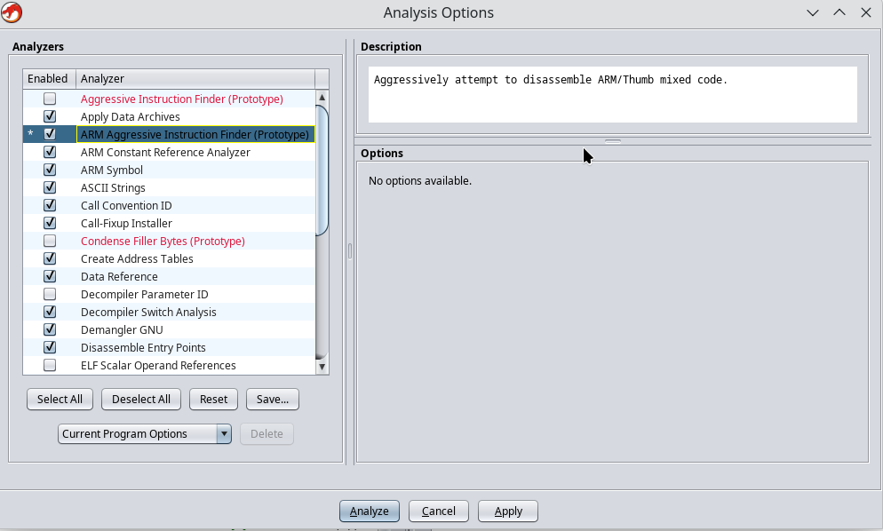

Once ghydra finish analyzing, we can see on left a list of functions. Ghydra doesn't know the funcion names (we don't have debug symbol aviable), so the name of the functions will be "FUN_addresslocation", not much fun really (sorry for the bad joke, it's kind of unavoidable).

# Locate interesting functions

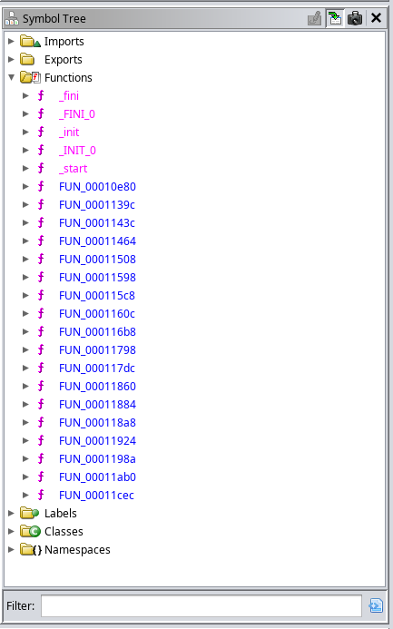

To start unrraveling the mistery that console_login is, we start by identifying the sections that produce certain strings. For that we need to check our beloved (at this point much hated, it took more time than I care to admit to understand the little fellow) mist AP41, to observe console_login in it's natural enviroment. The following comes from the serial console of one of this fellows, in all it's glory:

```
challenge: BRHw1Yy01Yi0zNS0yZi00Zi1iNHxkZXZlbG9wZXJ8qrvM3e7/qqusra6vuru8vQ==
response: 

```

So we have a place to start. Ghidra has a very handy string finder tool, Search --> For Strings. I changed the minimum lenght to 4 from the default 5 after a few tries. Remember to select Memory type All Blocks.

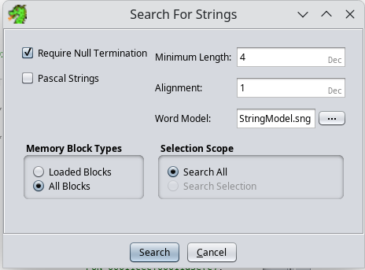

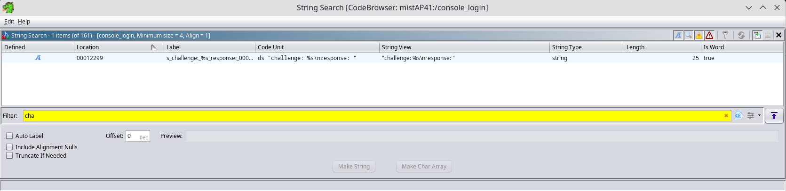

So there it is, at location 00012299, "challenge: %s\nresponse: ", If we selected it, on the Dissasmbled Listing view, we can see the following:
```
                             s_challenge:_%s_response:_00012299              XREF[2]:     FUN_00010e80:000111d2(*), 
                                                                                          FUN_00011cec:00011de2(*)  
        00012299 63 68 61        ds         "challenge: %s\nresponse: "
                 6c 6c 65 
                 6e 67 65 
``` 

So we know that 2 functions are using that text, FUN_00010e80 and FUN_00011cec, let's have a quick look at them:

In FUN_00010e80(), we see the following at the very begining:

``
  DAT_00023944 = basename(*param_2);
  if ((param_1 < 2) || (iVar2 = strcmp(param_2[1],"-h"), iVar2 == 0)) {
LAB_00010f2a:
     pcVar20 = "Usage: %s [-t] <username>\n";
  }
``

So this is probably the main function, let's rename it, and dig a bit further, on line 120, there's this:

``
     if ((iVar2 != 1) && (iVar2 = FUN_00011924("developer"), iVar2 != 0)) {
        iVar2 = FUN_00011cec(pcVar20,iVar2,pcVar17);
``

FUN_00011924("developer"), on line 17 calls FUN_00011464. If we have a look at the pseudo code FUN_00011464 bellow, it tries to read an i2c eeprom device, if it fails tries with a different eeprom.  

```
undefined * FUN_00011464(size_t *param_1)

{
  FILE *pFVar1;
  FILE *__stream;
  int *piVar2;
  char *pcVar3;
  size_t sVar4;
  int __errnum;
  
  sVar4 = DAT_000230e4;
  if ((int)DAT_000230e4 < 0) {
    __stream = fopen64("/sys/devices/i2c1.1/i2c-0/0-0052/eeprom","r");
    pFVar1 = stderr;
    if (__stream == (FILE *)0x0) {
      piVar2 = __errno_location();
      pcVar3 = strerror(*piVar2);
      fprintf(pFVar1,"Can\'t open %s: %s\n","/sys/devices/i2c1.1/i2c-0/0-0052/eeprom",pcVar3);
      *param_1 = 0;
      return (undefined *)0x0;
    }
}
```

Let's rename FUN_00011464 to get_eeprom_data . FUN_00011924("developer") calls get_eeprom_data(), so it's safe to assume that it will parse that information somehow. If you are still reading, thanks!, remember our first attemp to figure it this madness using the command string?, here is another interesting clue:

```
If you want this to be permanent set
 developer=%s
in uboot env
successful developer-mode console login
```

So we can assume FUN_00011924 parses the eeprom contents to get the value of an uboot env variable. So let's rename FUN_00011924 to get_uboot_env, and while we are on it, rename param 1 to uboot_env_var. We have already  idenitified 3 functions, not too bad. 

# FUN_00011cec, the developer challenge giver and receiver.

Let's check now FUN_00011cec, that function also access  the string "challenge: %s\nresponse: " at location 00012299. The part that interest us does the following:
1. Generates the developer ("D") challenge
2. Prints the base64 encoded challenge, with a leading "B" carachter and waits for an answer.
3. Reads a base64 encoded answer and performs basic checks.
4. Generates an expected response, and compares it with the provided answer 

A piece of pseudo code that looks very appealing is the following:  

```
  puVar5 = (undefined1 *)malloc(__n + 0x1d);
  if (puVar5 != (undefined1 *)0x0) {
    *puVar5 = 0x44;
    puVar5[1] = 0x7c;
    memcpy(puVar5 + 2,param_3,__n);
    puVar5[__n + 2] = 0x7c;
    pcVar12 = puVar5 + __n + 3;
    pcVar12[0] = 'd';
    pcVar12[1] = 'e';
    pcVar12[2] = 'v';
    pcVar12[3] = 'e';
    pcVar12 = puVar5 + __n + 7;
    pcVar12[0] = 'l';
    pcVar12[1] = 'o';
    pcVar12[2] = 'p';
    pcVar12[3] = 'e';
    puVar5[__n + 0xb] = 'r';
    puVar11 = local_78;
    puVar5[__n + 0xc] = 0x7c;
    puVar14 = (undefined4 *)(puVar5 + __n + 0xd);
    do {
      uVar6 = *puVar11;
      uVar13 = puVar11[1];
      puVar11 = puVar11 + 2;
      *puVar14 = uVar6;
      puVar14[1] = uVar13;
      puVar14 = puVar14 + 2;
    } while (puVar11 != auStack_68);
```

This is something that while obvious for a lot of people, was panfuly unknown to me. It took me more time than I care to admit to fully understand what's going in here. But my loose is your gain!, here is a quick overview of how to interpeter ghydra pseudocode.

If Ghydra doesn't know what kind of variable is dealing with, it will interpeter the dissasmble code into a sort of C or c(ish), wich if you prononounce quick enough sounds like "fish" (another bad joke, apologies). Here's a while loop that it's accesing data at a maximum of 4 bits at a time to concatenate the string "devoloper" into another variable

    puVar5 = (undefined1 *)malloc(__n + 0x1d);
    if (puVar5 != (undefined1 *)0x0) {
        *puVar5 = 0x44;
        puVar5[1] = 0x7c;
        memcpy(puVar5 + 2,param_3,__n);
        pcVar12 = puVar5 + __n + 3;
        pcVar12[0] = 'd';
        pcVar12[1] = 'e';
        pcVar12[2] = 'v';
        pcVar12[3] = 'e';
        pcVar12 = puVar5 + __n + 7;
        pcVar12[0] = 'l';
        pcVar12[1] = 'o';
        pcVar12[2] = 'p';
        pcVar12[3] = 'e';
        puVar5[__n + 0xb] = 'r';

And that's my fellow friends in reverse engineering and dump diving is how ARM works!, withouth getting into much detail, memory instructions in ARM assambly take 3+ cycles each. If you see this you can bet your beverage of a choice that you are dealing with an ARM binary. It took me some (a lot) time to realize that there's a better way. Let's put it like this, before starting to code in whatever language what you may think is an elaborate way of using the string "developer" for obscure cryptographic purposes, check your undefinded variables in Ghidra.

Did I say FIRST check your undefined variables in Ghidra before you make any assumptions? Let's focus on puVar5.

``
*puVar5 = 0x44;
``

That looks like a unsigned char * to me, so let's try recasting it with Ctrl + L, before doing anything else. Please, do this first will you? :

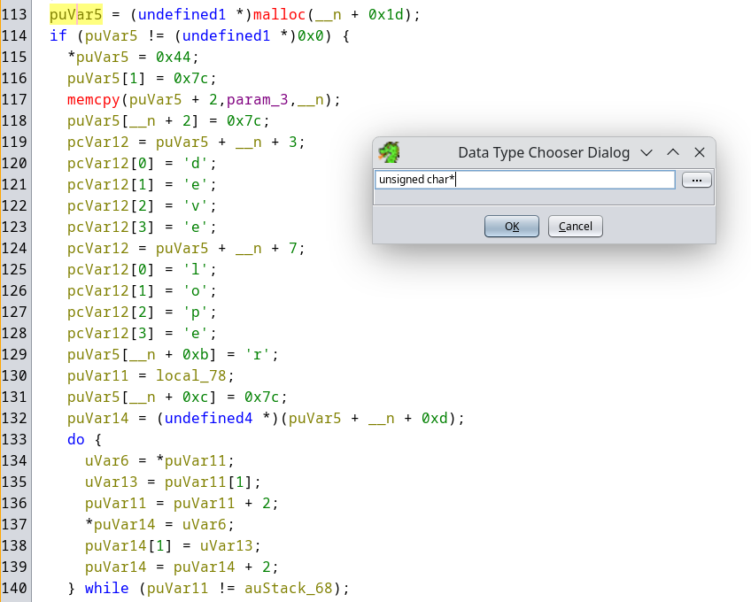

Bare and behold!, that while taking 4 bits at a time has transformed in something much readable (I also renamed puVar5, param_3 and __n for a much dramatic readability effect):

```
  challenge_container = (uchar *)malloc(mac_address_len + 0x1d);
  if (challenge_container != (uchar *)0x0) {
     *challenge_container = 'D';
     challenge_container[1] = '|';
     memcpy(challenge_container + 2,mac_address,mac_address_len);
     builtin_memcpy(challenge_container + mac_address_len + 2,"|developer|",0xb); // <-- much better!
     puVar10 = local_78;
     puVar13 = challenge_container + mac_address_len + 0xd;
     do {
        uVar5 = *puVar10;
        uVar12 = puVar10[1];
        puVar10 = puVar10 + 2;
        *(undefined4 *)puVar13 = uVar5;
        *(undefined4 *)(puVar13 + 4) = uVar12;
        puVar13 = puVar13 + 8;
     } while (puVar10 != auStack_68);
```

Now we have an idea of the structure of the developer challange:  "D|mac_address|developer|" + something. We also know that FUN_00011cec deals with the developer type of login, so in a display of imagination let's rename it to developer_login. And now we have 4 functions identified, but who is counting right?.

# Going further deep into the rabbit hole that developer_console (AKA FUN_00011cec)

We have identified the function that does both generating the challenge and checking the answer, at this point a good strategedy will be to identify all the functions that our beloved developer_login calls. We have two tools that can help with that , the first one is the  Function Call Graph with its magnificen "satellite view":

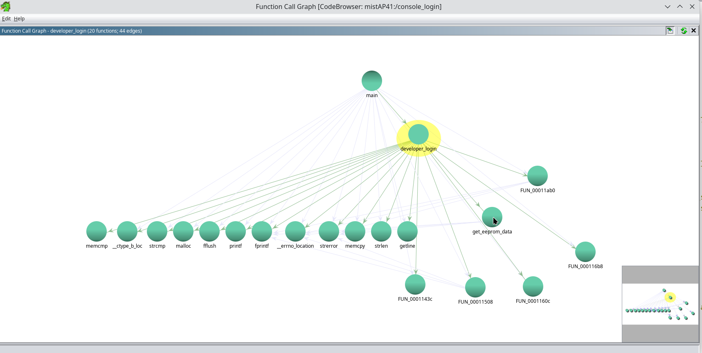

The second tool is the Function Call tree (Window --> Function Call Tree, it appears at the bottom). This tool shows the order in wich the functions are called. We can see here that the next unknown function called by developer_login is FUN_00011508, and a quick glance at the pseudo code shows that this function deals with gettin a random number from /dev/urandom. Following our crazy naming scheme, let's rename FUN_00011508 to get_urandom.

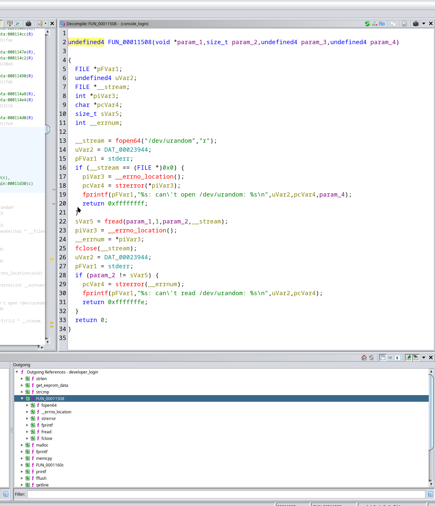

Using the Function Call Tree we can quickly jump into each of the unknown function's pseudo code. I'll spare you the (even more than last time) painful details. The following table has info on all the relevant functions used by developer_login. This will come in use later, when all seemed lost and yours truly was about to format his laptop and install ReactOS (good thing it can't boot on modern hardware yet, but try it anyway it's fantastic).

### functions called by developer_login at 00011cec: 

|name|location|notes|
|:---|:---:|:---|
|get_eeprom_data	|00011464|Needs "/sys/devices/i2c1.1/i2c-0/0-0052/eeprom"|
|bytes2base64	|0001160c|The name was in one of the error strings so I honour it|
|get_urandom	|00011508|Needs "/dev/urandom"|
|base642bytes	|000116b8|I applied reverse logic to the bytes2base64 error string mentioned before|
|get_sha256_HMAC	|0001143c|A wrapper for HMAC(), makes things way easier. https://docs.openssl.org/3.0/man3/HMAC/|
|log_event|	00011ab0|Needs "/rw/var/log/errors"	|


We know that one of the parameters for developer_login is the mac address with fields separated by "-", we will need that later too:

### get_mac_address details 

|name|location|notes|
|:---|:---:|:---|
|get_mac_address |000118a8|Needs "/sys/class/net/aximac1/address"|

# get_sha256_HMAC (AKA FUN_0001143c) gives us clues, and more Ghydra tips! . 

get_sha256_HMAC turned out to be a blessing from the sky. It's a simple wrapper function for OpenSSL's HMAC(), we can name the parameters according to https://docs.openssl.org/3.0/man3/HMAC/:

```
void get_sha256_HMAC(uchar *destination_md,void *key,int key_len,uchar *data,size_t data_len)

{
  EVP_MD *evp_md;
  
  evp_md = EVP_sha256();
  HMAC(evp_md,key,key_len,data,data_len,destination_md,(uint *)0x0);
  return;
}
```

The call from developer_login becomes more clear, we can identify the message and the key:

```
     b64_challange_len = base642bytes(answer_b64_dec,__size,challenge_b64_enc,sVar7 - 1);
     if (b64_challenge_len < 0x30) {
        return 0;
     }
     if ((iCheckDeveloper == 0) &&
          (b64_challenge_len = memcmp(answer_b64_dec,&random_number_container,0x10),
          b64_challenge_len != 0)) {
        return 0;
     }
     get_sha256_HMAC(sha256_first_hmac,eeprom_raw + 0x400,0x10,answer_b64_dec,0x10);
```

The 16 bit key for our digest is at adress 0x400 of the eeprom (eeprom_raw_dump + 0x400,0x10). As for the message , is the first 16 bits  of the answer. If those frsts bits are different from the stored random_number, it returns 0 and doesn't attemp the SHA256 HMAC calculation. Succes! At this point console_login is no longer a secret box that spells outs nonsense, perhaps there's light at the end of the tunnel? 

There's another Ghidra feature that can help with the pseudo code. There are some variables that will get used for different functions along the program, so just naming them doesn't really give you a full picture. From our (by now very familiar) developer_login example above, the avid Ghidra user/github reader may have noticed that b64_challange_len at some point is the lenght of a base64 decoded string, and a few lines later is used to hold either a 0 or 1 in a memory compare operation. We can Split it out as new variable (right click on a var name --> Split Out as a New Variable)

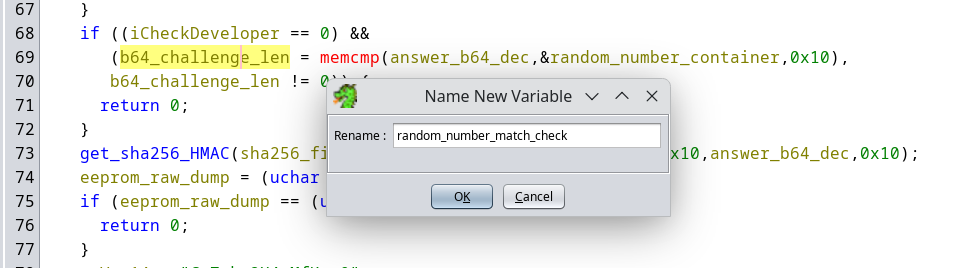

# The hard truth about types

So we are almost ready to start coding something, but before moving on, a cautinary tale about types. This may save you hours (days, weeks, months even!) in your future reverse enginiring projects. We had stablish that before making assumtions is best to identify the type of variables that we are dealing with, that will clear the pseudo code view. And we are doing it, so give your self a round of aplause. In the specifc case of get_sha256_hmac we have an unsigned char *  eeprom_raw  that holds the key parameter, both as a name and as importance millestone (yeap, another bad joke). We understand  the concept of eeprom_raw + 0x400,0x10 an we move along right?.

Things could have been different, imagine for a moment that eeprom_raw it's typed as a byte[4]*. A char is one byte, and one byte "should be" 8 bits (check limits.h, macro CHAR_BIT has a default value of 8). So look how  get_ssha256_hmac get's called by developer_login in the pseudo code now:

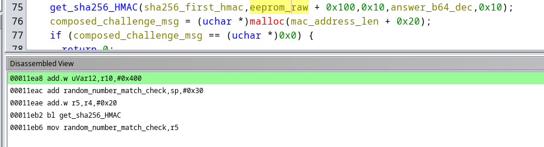

It looks like our 16 bit key is stored at address 0x100 in the eeprom (instead of 0x400), so we move on and start coding. Only to cry in dispair later, when console_login is laughing at our punny attempts to resolve the challenge with the wrong key. Type miscasting is one of the dangers of this hobby, be on the look my fellow tinkerers!. It took me time (days) to realize this, please look at the Dissamble view! (Window --> Dissasmbled View) , the value there is 0x400 as it should. In fact, leave that Dissambled View there from now on, you'll live longer.

# Putting it all together, the mighty developer answer

It took some time to reach this point. Among other things, there have been laughters, tears, nightmares and exploration of alternate OS. But we know what's going on inside console_login, is not longer a black box (at list when developer=true):

1. Generates a challenge with the following structure "D|<mac address, field separated by '-'>|developer|16 bit random number
2. Generates an expected answer, and compares it with the one given at stdin

After clearing a bit undefined variables, we know that the developer answer format! (it's ok to pause for a moment here):

16 bits random number + 32 bits HMAC digest. 

For the HMAC recipe, we need 3 ingredients, show bellow in woderfull Ghidra pseudo-code:

1. 32 bits sha256 hmac digest of the challenge's random number,  using a 16 bits key stored at address 0x400 of the device's eeprom.
```
  get_sha256_HMAC(sha256_first_hmac,eeprom_raw + 0x400,0x10,answer_b64_dec,0x10);
```

2. A 49 bits message: Cm7nkp2X4cMfKuw0 + mac address, fields separated by "-" + fqxWAIytIQt26vkU 
```
mac_address = "11-22-33-44-55";
secret_part_1 = "Cm7nkp2X4cMfKuw0";
secret_part_2 = "fqxWAIytIQt26vkU";
composed_challenge_msg = (uchar *)malloc(mac_address_len + 0x20);
memcpy(composed_challenge_msg,secret_part_1,0x10);
memcpy(composed_challenge_msg+0x10,mac_address,mac_address_len);
memcpy(composed_challenge_msg+(0x10+mac_address_len),secret_part_2,0x10);
```

3. 32 bits sha256 hmac digest of the message, using the first sha256 digest as a key.
```
  get_sha256_HMAC(sha256_answer_hmac,sha256_first_hmac,0x20,composed_answer_msg,(mac_address_len + 0x20));
```

So that's it!, we can finally start implementing this, we have the technology we can make it better, faster!. We have a clear understanding of the answer ,and it should work right? Well it didn't. At this point any sane person will give up, and keep on living. So I guess I need to visit a shrink because I continued torturing myself (remember my dear electronic dwellers, we don't really need this to modify the firmware, we own uboot).

# Tears, back pain and qemu

At this point the situation was not looking good. I had a few  program test running (I tried several languages before C), but everytime that I make a change, this was the workflow:

- Connect the serial console, wait for the mist AP to boot. Use the shortest posible USB cable at hand, to add more disconfort (hence the back pain).
- Try one answer, wait for it to fail.
- Try the same answer again and expect a different result, because Rita Mae Brown said that's the definition of insanity.
- Scream and/or cry for a while, start again.

Clearly that plan was not gonna work, so what about running console_login outside of it's natural enviroment? can qemu shine a light and help us navigate the deep waters of console_login internals? You bet it can, using good old "chroot".

# Fooling console_login and laughing back at it (setting up an ARM chroot enviroment)

This step is easy, we already have an ARM chroot enviroment courtesy of https://github.com/neggles/mist-ap41 
```
git clone https://github.com/neggles/mist-ap41
cd mist-ap41/ubidump
cp /usr/bin/qemu-arm-static rootfs2/bin/
sudo chroot rootfs2/ qemu-arm-static /bin/sh
```

That's it, no docker, cloud, spinning VMs or SaaS shennanigans. But console_login knows!, if we try to run it laughs and returns 1

```
/ # console_login root
Can't open /sys/devices/i2c1.1/i2c-0/0-0052/eeprom: No such file or directory
Login incorrect
```

But fear not, we come prepared. From our [developer_login table](#functions-called-by-developer_login-at-00011cec), we know that a few files are needed:

- /sys/devices/i2c1.1/i2c-0/0-0052/eeprom: We can get this from uboot cli, check the [README](/README.md#getting-access-to-the-uboot-promt-at-boot) file.

    ```
    cd mist-ap41/ubidump/
    mkdir -p rootfs2/sys/devices/i2c1.1/i2c-0/0-0052
    cp eeprom.bin rootfs2/sys/devices/i2c1.1/i2c-0/0-0052/eeprom
    ```

- /dev/urandom: It's not gonna be that random, we control the enviroment. Let's create a 32 bit(ish) file with known contents:

    ```
    cd mist-ap41/ubidump/dev
    mkdir ../tmp/log 
    echo -e '\xaa\xbb\xcc\xdd\xee\xff\xaa\xab\xac\xad\xae\xaf\xba\xbb\xbc\xbd' > urandom
    echo -e '\xaa\xbb\xcc\xdd\xee\xff\xaa\xab\xac\xad\xae\xaf\xba\xbb\xbc\xbd' >> urandom
    ``` 

- /sys/class/net/aximac1/address: Our emulated mac address:
    
    ```
    cd mist-ap41/ubidump/
    mkdir -p rootfs2/rw/var/log/errors
    mkdir -p rootfs2/sys/class/net/aximac1
    echo "11:22:33:44:55:66" > rootfs2/sys/class/net/aximac1/address
    ```

The last step is to check if we have developer=true in our eeprom, we can use a a lua script in the original firmware for this:

    sudo chroot rootfs2/ qemu-arm-static /bin/sh
    / # ubootenv r developer
    true

In case the env is not there, we can use the same handy script (thanks mist developers!):

    / # ubootenv w developer true   

So now let's try again console_login:

    / # console_login root
    challenge: BRHwxMS0yMi0zMy00NC01NS02NnxkZXZlbG9wZXJ8qrvM3e7/qqusra6vuru8vQ==
    response: 

Tears again, this time from hapiness my ARM hard rocking amigos. We can now test console_login in different ways, away from the original hardware. That's right, you can also expirience the joy and the worm feeling of added security that console_login has to offer, in the confort of your own hardware!. And since /dev/urandom has a known value, the challenge is always the same, this is great for testing.

# Getting even more back at console_login with gdb 

For gdb to work properly, we need to mount proc inside our chroot enviroment:
```
/ # mkdir /proc
/ # mount proc /proc -t proc
/ # console_login root
```

With the binary running in a controlled enviroment, we can poke around with memory. Something like this works:

  sudo gdb -p $(ps -ef | grep /usr/bin/qemu-arm-static | grep -v grep |  awk '{print $2}')

```
For help, type "help".
Type "apropos word" to search for commands related to "word".
Attaching to process 71608
[New LWP 71610]
0x00007fece2006f99 in safe_syscall_base ()
Missing rpms, try: dnf --enablerepo='*debug*' install qemu-user-static-arm-debuginfo-9.1.3-2.fc41.x86_64
(gdb) set detach-on-fork off
(gdb) set follow-fork-mode child
(gdb)
```

I don't know about you, but I've never start a gdb session witouth set detach-on-fork off and set follow-fork-mode child. If console_login tries to launch another thread, gdb will follow. Next step is to check the memory mappings.

```
(gdb) info proc mappings
process 74584
Mapped address spaces:

Start Addr         End Addr           Size               Offset             Perms File 
0x0000000000010000 0x0000000000013000 0x3000             0x0                r--p  /tmp/mist-ap41/ubidump/rootfs2/bin/console_login 
0x0000000000013000 0x0000000000022000 0xf000             0x0                ---p   
0x0000000000022000 0x0000000000023000 0x1000             0x2000             r--p  /tmp/mist-ap41/ubidump/rootfs2/bin/console_login 
0x0000000000023000 0x0000000000024000 0x1000             0x3000             rw-p  /tmp/mist-ap41/ubidump/rootfs2/bin/console_login 
0x0000000000024000 0x0000000000027000 0x3000             0x0                rw-p   
0x0000000000027000 0x0000000040000000 0x3ffd9000         0x0                ---p   
0x0000000040000000 0x0000000040001000 0x1000             0x0                ---p   
0x0000000040001000 0x0000000040801000 0x800000           0x0                rw-p   
0x0000000040801000 0x0000000040806000 0x5000             0x0                r--p  /tmp/mist-ap41/ubidump/rootfs2/lib/ld-uClibc-1.0.26.so 
0x0000000040806000 0x0000000040815000 0xf000             0x0                ---p   
0x0000000040815000 0x0000000040816000 0x1000             0x4000             r--p  /tmp/mist-ap41/ubidump/rootfs2/lib/ld-uClibc-1.0.26.so 
0x0000000040816000 0x0000000040817000 0x1000             0x5000             rw-p  /tmp/mist-ap41/ubidump/rootfs2/lib/ld-uClibc-1.0.26.so 
0x0000000040817000 0x0000000040818000 0x1000             0x0                r--p   
0x0000000040818000 0x000000004081a000 0x2000             0x0                rw-p   
0x000000004081a000 0x0000000040909000 0xef000            0x0                r--p  /tmp/mist-ap41/ubidump/rootfs2/usr/lib/libcrypto.so.1.0.0 
0x0000000040909000 0x0000000040919000 0x10000            0x0                ---p   
0x0000000040919000 0x0000000040927000 0xe000             0xef000            r--p  /tmp/mist-ap41/ubidump/rootfs2/usr/lib/libcrypto.so.1.0.0 
0x0000000040927000 0x000000004092e000 0x7000             0xfd000            rw-p  /tmp/mist-ap41/ubidump/rootfs2/usr/lib/libcrypto.so.1.0.0 
0x000000004092e000 0x0000000040930000 0x2000             0x0                rw-p   
0x0000000040930000 0x000000004098f000 0x5f000            0x0                r--p  /tmp/mist-ap41/ubidump/rootfs2/lib/libuClibc-1.0.26.so 
0x000000004098f000 0x000000004099e000 0xf000             0x0                ---p   
0x000000004099e000 0x000000004099f000 0x1000             0x5e000            r--p  /tmp/mist-ap41/ubidump/rootfs2/lib/libuClibc-1.0.26.so 
0x000000004099f000 0x00000000409a0000 0x1000             0x5f000            rw-p  /tmp/mist-ap41/ubidump/rootfs2/lib/libuClibc-1.0.26.so 
0x00000000409a0000 0x00000000409b7000 0x17000            0x0                rw-p   
0x00000000409b7000 0x00000000ffff0000 0xbf639000         0x0                ---p   
0x00000000ffff0000 0x00000000ffff1000 0x1000             0x0                r--p   
0x00000000ffff1000 0x0000000100000000 0xf000             0x0                ---p   
0x000055555bc73000 0x000055555bcff000 0x8c000            0x0                rw-p  [heap] 
```

Seems that 0x24000 is our sweet memory spot. We can have a peak with x/3000s 0x24000. Ghydra also agrees, 0x24000 shows as the EXTERNAL section in the Memory Map (Window --> Memory Map)

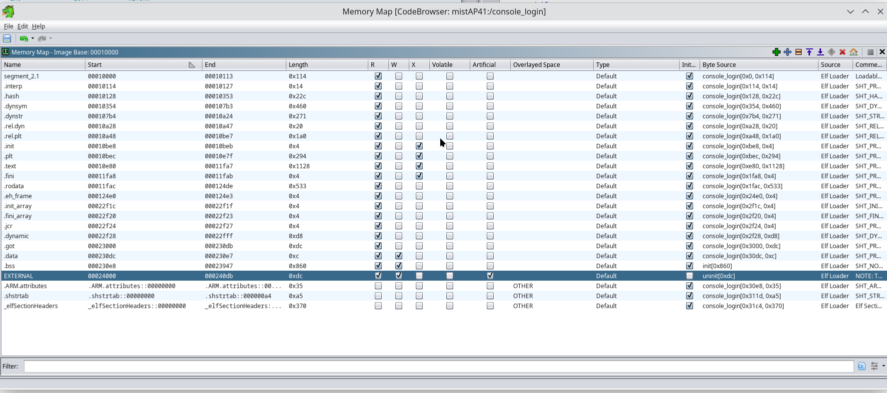


```
(gdb) x/3000s 0x24000
0x24000:        ""
0x24001:        ""
0x24002:        ""
0x24003:        ""
0x24004:        "\031"
0x24006:        ""
0x24007:        ""
0x24008:        "4LXBKCGJVAQC6V4"
0x24018:        "X@\002"
0x2401c:        "\021"
0x2401e:        ""
0x2401f:        ""
0x24020:        "true"
0x24025:        "c\233@p@\002"
0x2402c:        "9"
0x2402e:        ""
0x2402f:        ""
0x24030:        "D|11-22-33-44-55-66|developer|\252\273\314\335\356\377\252\253\254\255\256\257\272\273\274\275"
0x2405f:        ""
0x24060:        ""
0x24061:        ""
0x24062:        ""
0x24063:        ""
0x24064:        "I"
0x24066:        ""
0x24067:        ""
0x24068:        "BRHwxMS0yMi0zMy00NC01NS02NnxkZXZlbG9wZXJ8qrvM3e7/qqusra6vuru8vQ=="
0x240aa:        ""
0x240ab:        ""
0x240ac:        "I"
0x240ae:        ""
0x240af:        ""
--Type <RET> for more, q to quit, c to continue without paging--
```

We can see at location 0x24030 the generated challenge, and we were right about the challenge format!, our fake random number is staring back at us from address 0x24060 

We have the address of the functions called by developer_login in our [little table](#functions-called-by-developer_login-at-00011cec), so let's set a breakpoint. 
get_sha_256_hmac is a good target, it only get's called if the first 16 bits of the answer are equal to the random number from the challenge:

```
(gdb) awatch *0x001143c
Hardware access (read/write) watchpoint 1: *0x001143c
(gdb) continue 
Continuing.
```

If we give console_login a partialy right answer, gdb reacts and halts the execution when get_sha256_hmac gest accesed. A quick peek with our favorite gdb command (x), and we see that our answer is at address 0x24138:

```
Thread 1 "console_login" hit Hardware access (read/write) watchpoint 1: *0x001143c

Value = -1333414416
0x00007f54bc8fcfba in translator_ld ()
(gdb) x/1s 0x24138
0x24138:        "\252\273\314\335\356\377\252\253\254\255\256\257\272\273\274\275zUÜA=\331-\226&\263\364eg+HH[\2240\355y\rz\371\370{\247\f\211\275s"
(gdb) 
```

Placing different watchpoint and checking the memory contents it's a terrific way to get more information. In my tests I found out that I was sending an extra null character before the random number, so get_sha_256_hmac wasn't called to begin with. 

But our friend console_login has a behaviour that works in our advantage (who is laughing now!). If the developer answer is incorrect, the main thread continues, and generates a type A challange with a different structure. At this point I can pretty much tell by memory the Ghydra pseudo code for developer_login, and there are some malloc here and there, but not many free(). So if we hit Ctrl + C after a wrong developer answer while gdb is listening:

```
challenge: BRHwxMS0yMi0zMy00NC01NS02NnxkZXZlbG9wZXJ8qrvM3e7/qqusra6vuru8vQ==
response: BqrvM3e7/qqusra6vuru8vXpVw5xBPdktliaz9GVnK0hIW5Qw7XkNevn4e6cMib1z
Incorrect response
challenge: BQXwxMS0yMi0zMy00NC01NS02Nnxyb290fKq7zN3u/6qrrK2ur7q7vL0KqrvM3e7/qqusra6vuru8
response: ^C
```

```
Thread 1 "console_login" received signal SIGINT, Interrupt.
0x00007f54bc806f99 in safe_syscall_base ()
(gdb) x/1s 0x24170
0x24170:        "Cm7nkp2X4cMfKuw011-22-33-44-55-66fqxWAIytIQt26vkU"
(gdb)
```

What a glourous view at location 0x24170! This is the msg generated to check if the answer is correct, so we were right about that part too. After an unsuscesfull operation 0x24170 should have been freed, but it aint. This helped me further troubleshoot my first attempts at cracking the challenge, I was sending extra NULL characters in this case aswell. 

# Conclusion

So my compadres and comadres in bit counting, we have learned a lot of valiuable lessons!, but I will just hihglight 3:

1. Ghydra pseudo code it's a very valuable tool, but it's an educated guess. Check your undefined variables against the Dissambled View and make sure it make sense (0x100 is not the same as 0x400)
2. malloc, memcpy and alike are great, it's one of the reasons C is so funny, but don't forget about free. valgrind -s --leak-check=full it's your friend in this situation.
3. gdb is a beast of a tool, I'm only showing the very basic commands that got me through this. 

console_login laughs no more, this has been a fun trip. 
